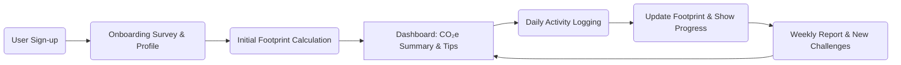

# Carbon Footprint Awareness Platform

## Executive Summary  
A **Carbon Footprint Awareness Platform** helps individuals calculate, track and reduce their personal greenhouse gas (GHG) emissions. It combines authoritative emissions factors (from IPCC, EPA, DEFRA etc.) with user-entered activities to estimate CO₂e. By presenting results in engaging dashboards and coaching users through personalized actions (e.g. energy savings, travel choices, diet changes), it promotes long-term behavioural change. The platform’s MVP includes user signup, multi-category footprint calculator, basic analytics and recommendations. Advanced features add gamification, AI-driven coaching and community challenges. The design prioritizes data accuracy (using official emission datasets), privacy (GDPR-compliant), accessibility (WCAG 2.1+), security (OWASP best practices) and performance. Key metrics include user engagement and actual emissions reduction. The roadmap phases out development (MVP in ~6–72 hours) with iterative milestones. The system uses modern web frameworks (e.g. Next.js, Tailwind, Supabase) with CI/CD pipelines and tests. **Citations:** Official conversion factors and guidelines are used throughout.  

## Problem Statement  
Global climate goals require reducing carbon emissions, but individuals often **misjudge their impact**. For example, studies show people underestimate emissions from daily actions (one user learned their footprint was triple the global average). Many lack easy tools to quantify emissions from driving, flying, energy use, diet and waste. Existing calculators are fragmented or overly complex. The challenge is to create an engaging platform that **raises awareness** by accurately calculating personal carbon footprints and guiding sustainable habits. Users need a simple way to log activities and immediately see their CO₂e impact, with clear suggestions on how to reduce it (e.g. switching to LED bulbs or taking transit).

## Objectives  
- **Measure:** Provide an easy-to-use calculator covering transport, energy, food and waste emissions.  
- **Educate:** Use reliable data (IPCC, DEFRA, EPA, IEA) so users trust the results.  
- **Motivate:** Encourage habit change via personalized suggestions, gamification, and tracking of improvements.  
- **Engage:** Maintain weekly activity loops (daily logging → progress feedback → new goals) to build long-term habits.  
- **Comply:** Ensure privacy (GDPR), security (data encryption, OWASP compliance) and accessibility (WCAG 2.1 AA) are baked into the design.

## Target Users and Personas  
The platform targets **environmentally concerned individuals** who want to quantify and reduce their footprint. Four example personas illustrate key user segments:

- **Eco-conscious Emma (25–35, UK IT Professional):** Tech-savvy urbanite who cycles and buys organic food. **Goals:** Lower her carbon score and influence friends. **Pain:** Unsure how to compare her impact vs others and find reliable reduction tips.  
- **Family-focused Priya (35–45, India, Parent):** Balances career and family life. **Goals:** Teach her children eco-friendly habits and reduce household bills. **Pain:** Limited time to research; needs clear actionable steps and reminders.  
- **Budget Student Alex (18–24, USA Student):** Lives on a tight budget, mostly eats plant-based, but commutes and shops online. **Goals:** Maximize impact reduction while saving money. **Pain:** Lacks knowledge on which daily actions make a difference; skeptical of hidden data collection in apps.  
- **Frequent Flyer Carlos (30–45, Europe Business Traveler):** Spends much time on planes. **Goals:** Offset his air travel emissions and find greener travel alternatives. **Pain:** Feels guilty about flights, wants an easy way to track and compensate.  

Each persona has unique demographics, motivations and barriers, guiding feature prioritization (e.g. student wants low-cost tips, working parent needs time-saving UI).

## User Journeys  
A user’s journey typically follows signup → onboarding → ongoing engagement:

- **Signup:** User registers via email/Social SSO. Minimal profile (location, household info, travel preferences).  
- **Onboarding & First Use:** User takes a quick survey (e.g. car type, diet type, weekly commute) to estimate a **baseline footprint**. The app immediately displays a dashboard with total CO₂e and breakdown by category (travel, home energy, food, waste).  
- **First Actions:** The dashboard suggests a few “quick wins” (e.g. “Try one meatless meal per week”, or “Switch to LED bulbs”), reinforcing the link between actions and CO₂ reduction.  
- **Daily/Weekly Loop:** Each week, users log activities (e.g. daily commute distance, electricity usage, meals, recycling). The app recalculates their footprint and shows trend charts. By week’s end, a summary highlights improvements and missed targets. Users earn points/badges for completed green actions. Notifications or email nudge them to log data and view results.  



This **habit loop** (log → feedback → goal setting) drives engagement and gradual behaviour change.

## Core Features  
**MVP Features (must-have):**  
- **Multi-Category Emissions Calculator:** Calculates CO₂e from user inputs in Transport (car, bus, train, flights), Energy (electricity, gas), Food consumption (meat, dairy, plants), and Waste (landfill, recycling).  
- **User Profile & Authentication:** Secure signup/login (email, OAuth). Stores basic personal factors (household size, car MPG, diet type).  
- **Activity Logging Interface:** Forms to input daily/weekly values (e.g. “km driven”, “kWh used”, “kg beef consumed”). Supports manual entry and simple integrations (e.g. odometer sync).  
- **Dashboard & Analytics:** Visual summary of current footprint (number of tonnes CO₂e), breakdown by category (pie/bar charts), and historical trend line (last 4 weeks).  
- **Basic Recommendations:** Static tips related to major emission sources (e.g. “Plant a tree to offset 10 kg CO₂”, “Use public transport”). Possibly a checklist of actions.  
- **Privacy & Settings:** Options for data export/deletion to comply with GDPR.

**Advanced Features (nice-to-have):**  
1. **Gamification & Rewards:** Points, badges and leaderboards for sustainable actions. E.g. *“5-day streak of logging activities”* badge, virtual reward store or unlocking content.  
2. **AI-Powered Personal Coach:** Use an AI (e.g. GPT-4 or Google Gemini) to generate tailored suggestions. For example, a chatbot could advise: “Switch to a 3-star rated energy efficient appliance, saving ~20% electricity.” Or recommend local bike-share options.  
3. **Social/Community Features:** Friends/peer comparison, team challenges (e.g. family leaderboard). Share achievements on social media.  
4. **Smart Integrations:** Connect to APIs (e.g. Google Maps for trip distances, smart meter for energy). Automatically track transport via GPS if user consents.  
5. **Carbon Offsetting Marketplace:** Allow users to offset residual emissions by purchasing verified credits (link to external providers).  
6. **Premium Analytics & Forecasting:** Predict future footprint under different scenarios, simulate impact of lifestyle changes (e.g. “If you replace car trips with cycling 3 times a week, you’ll save X kg CO₂/month”).

Each feature aligns with user needs: personalization and gamification increase motivation (as seen in Pawprint/EarthHero apps), while AI suggestions make the experience smarter and more engaging.

## UI/UX Design (Wireframe Concepts)  
The UI should be **clean, intuitive and mobile-first**. Key screens and components include:

- **Landing Page:** Hero banner (e.g. “Track your Carbon Footprint”) and call-to-action (Sign Up).  
- **Onboarding/Signup Flow:** Simple form (or OAuth sign-in). Possibly a friendly quiz (diet, commute) illustrated with icons.  
- **Dashboard:** A card layout showing:  
  - **Total Footprint:** Big number of CO₂e (tons) with time-frame (weekly, monthly).  
  - **Category Breakdown:** Interactive pie or bar chart (transport vs energy vs food vs waste).  
  - **Trend Chart:** Line chart of emissions over past weeks.  
  - **Quick Actions Panel:** List of suggestions or challenges (each with an icon and “Complete” button).  
- **Activity Logger:** Multi-step forms or tabs to log: transport (with options for mode, distance), energy usage, meals (select food items), and waste disposal. Each section uses dropdowns/sliders for ease of use.  
- **Recommendations Page:** Shows personalized tips or an AI chat interface.  
- **Profile/Settings:** User info, carbon goals, app preferences (units, notifications).  
- **Visual Style:** Use clear typography, friendly icons (car, house, leaf), and ample whitespace. Provide immediate feedback (e.g. “You saved X kg CO₂ this week!”).  

**Wireframe Example:** A sample dashboard wireframe might feature a top nav bar, a summary card on the left, and charts on the right. Input forms use cards with concise labels (“Fuel used (L) / Distance (km)”). Provide **tooltips** to explain scientific terms. 

## Data Model (ER Diagram)  
A relational data model could include tables such as **User, Activity (EmissionEntry), Recommendation, Badge**, etc. Below is a simplified Entity-Relationship diagram (Mermaid):

```mermaid
erDiagram
    USER {
        int id PK
        string name
        string email
        datetime created_at
    }
    ACTIVITY {
        int id PK
        int user_id FK
        string category
        float amount
        string unit
        datetime date
        float co2e  // calculated emissions for this record
    }
    RECOMMENDATION {
        int id PK
        int user_id FK
        string suggestion
        bool completed
        float est_co2_saved
    }
    BADGE {
        int id PK
        string name
        string description
    }
    USER ||--o{ ACTIVITY : logs
    USER ||--o{ RECOMMENDATION : receives
    USER ||--o{ BADGE : earns
```

- **User:** Stores user credentials and profile info.  
- **Activity:** Each log entry (e.g. “Drove 20 km” or “Used 15 kWh”) with its computed CO₂e.  
- **Recommendation:** Tailored tips/actions assigned to a user, with completion status.  
- **Badge:** Predefined achievement (e.g. “Eco Warrior”) earned by users.  

This schema supports efficient queries: e.g. summing CO₂e from `ACTIVITY` grouped by category for a user.

## Emission Calculation Methodology  
Each activity’s CO₂e is computed as:  
```
CO2e (kg) = activity_amount × emission_factor
```  
where the *emission_factor* (kg CO₂e per unit) comes from authoritative sources. Major formulas:

- **Transport:**  
  - *By fuel:* `CO2 = liters_of_fuel × EF_fuel`, e.g. gasoline: 2.3 kg CO₂/liter (≈8887 g/gallon).  
  - *By distance:* `CO2 = distance_km × EF_mode`, e.g. average car ≈0.171 kg/km (EPA ~400 g/mile), bus ~0.105 kg/km, train ~0.041 kg/km. Flights ~0.158 kg/km (as per UK DfT).  
- **Electricity/Energy:**  
  `CO2 = kWh_used × EF_elec`. For example, UK grid ~0.25 kgCO₂e/kWh (2025 factors trending ~0.18–0.25). Natural gas ~0.2 kgCO₂e/kWh or 2.07 kg/m³.  
- **Food:**  
  `CO2 = mass_food × EF_food`. For instance, beef ~60 kgCO₂e/kg, cheese ~21, poultry ~6, fish ~5, bananas ~0.7, nuts ~0.3. These values come from large meta-analyses (e.g. Poore & Nemecek 2018 via OurWorldInData).  
- **Waste:**  
  `CO2 = kg_waste × EF_waste`. Landfilled organic waste ~0.6 kgCO₂e/kg (EPA WARM model). Recycling might count as negative or lower emissions.

*Sample calculation:* Driving 100 km by car at 0.18 kg/km yields 18 kg CO₂e. Using 100 kWh of electricity (grid 0.25 kg/kWh) yields 25 kg CO₂e. Eating 0.5 kg of beef yields ~30 kg CO₂e. Landfilling 5 kg of food waste adds ~3 kg CO₂e. All totals update the user’s weekly footprint.

*(Note: CH₄ and N₂O from vehicles or livestock are included via CO₂-equivalent factors in these EF values.)*

## Emission Factors and Data Sources  
We prioritize **official and primary datasets** for emission factors:  
- **IPCC Emission Factor Database:** Global EF for fuels, agriculture, waste (e.g. GWP100 values from AR6) as referenced by EPA and others.  
- **DEFRA/DESNZ (UK Government):** Annual GHG conversion factors (2025) for UK and international reporting. These include updated electricity grid factors, transport, waste, etc.  
- **US EPA GHG Emission Factors Hub:** Provides curated, annually-updated factors (mobile combustion, electricity (eGRID), WARM for waste). For example, EPA’s WARM landfill factor ~580 kg CO₂e/ton (≈0.64 kg/kg).  
- **IEA/UN Data:** IEA provides country electricity carbon intensities; FAO and scientific literature for agriculture (e.g. FAOSTAT emissions, Poore & Nemecek 2018).  
- **GHG Protocol Tools:** Emission factors for upstream/downstream scopes (useful for supply chains, not primary here).  
- **Open Datasets/APIs:** Tools like [Climatiq](https://www.climatiq.io/) compile these sources programmatically.

All factors will cite their sources. For example, Poore & Nemecek’s meta-analysis (via OurWorldInData) underpins many food EF values, while DEFRA provides transport and energy factors. We store factors in the database or code constants, and update them regularly to reflect new data.

## APIs and Libraries  
- **Frontend:** React (Next.js) with TypeScript. UI component libraries like **Tailwind CSS** (possibly Shadcn/ui or Material-UI) for rapid design. Charting with libraries such as **Recharts** or **Chart.js** for graphs. Form handling with React Hook Form.  
- **Backend:** Node.js/Express or Python/FastAPI. Expose REST/GraphQL endpoints for user data and calculations. Authentication via **Clerk** or **Firebase Auth** for secure sign-on. Database using **Supabase (PostgreSQL)** or similar.  
- **Data & Emissions:** A service/module holds emission factors (could use [Climatiq API](https://www.climatiq.io/) for realtime lookups) and computes CO₂e.  
- **AI/Personalization:** OpenAI GPT-4/ChatGPT or Google Gemini API for natural-language coaching and content generation. Local ML models (TensorFlow.js or PyTorch) could predict high-impact actions based on user patterns.  
- **Others:** Axios or Fetch API for requests, React Query for state, Jest/PyTest for testing, Github Actions for CI/CD.  
- **Alternatives:** For stacks, alternatives include Angular or Vue (frontend), Django/Flask (backend), Auth0 (auth), MongoDB/DynamoDB (NoSQL DB), and D3.js or Highcharts (visualizations). Choice depends on developer skill; we assume a JS/TS full-stack familiarity.

## System Architecture  
The system is a cloud-hosted web application with clear separation of concerns:

```mermaid
flowchart LR
    subgraph Client (Web/Mobile)
      A[Next.js UI (React)]
    end
    subgraph Auth
      E[Auth Service (Clerk/Firebase)]
    end
    subgraph Server
      B[Backend API (Node.js/Express or FastAPI)]
      D[AI/ML Service (GPT API)]
    end
    subgraph Storage
      C[(Database: PostgreSQL/Supabase)]
      F[(Object Store for Media)]
    end

    A --> B
    A --> E
    B --> C
    B --> D
    B --> F
    E <--> B
    A <--> E
```

- The **Frontend** (React/Next.js) interacts with the **Backend API** over HTTPS.  
- **Authentication Service** (Clerk/Auth0) handles login/signup and issues tokens to the frontend.  
- The **Backend** reads/writes user profiles, logs and emission entries in the database, and calls the AI/ML service (e.g. OpenAI) for recommendations.  
- **Database** (cloud-hosted SQL) stores user and activity data; an optional Object Store holds static assets (icons, etc.).  
- The platform can deploy on serverless hosting (Vercel for frontend, serverless functions or managed Node for backend, Supabase for DB) to scale transparently.

## Privacy, Security & Compliance  
- **Privacy (GDPR):** Collect only necessary data (e.g. no tracking beyond carbon entries). Offer user control (view/delete data). Use explicit consent for data usage. Publish a clear privacy policy. If targeting EU/UK/India, comply with GDPR/India’s data laws by encrypting PII at rest and in transit (HTTPS/TLS), anonymizing any analytics, and obtaining opt-in for cookies or third-party services.  
- **Security:** Follow OWASP Top-10 protections. Use prepared statements to avoid injection. Hash passwords (bcrypt/scrypt). Store secrets securely (env vars, Vault). Enforce HTTPS and use HTTP security headers. Use libraries for common vulnerabilities scanning. Regularly update dependencies. Conduct security code reviews and penetration tests.  
- **Accessibility:** Design to **WCAG 2.1 AA** standards. Provide high-contrast color schemes (meet contrast ratios), alt text for images, keyboard navigability, and ARIA roles for dynamic content. Ensure forms have labels, use a logical tab order, and support screen readers. Implement accessible color palettes (see next section) and test with tools like Lighthouse or axe.  
- **Compliance:** Although local laws are unspecified, assume general requirements: no sensitive data storage beyond what’s needed, data localization if required (e.g. UK user data stored EU/UK), and compliance with any governmental guidelines on environmental claims (e.g. avoid misleading statements). Provide terms of service.

## Testing Strategy and CI/CD  
- **Automated Testing:**  
  - *Unit Tests:* Cover all calculation functions and components (Jest for JS, PyTest for Python). Aim for high coverage (e.g. >80%).  
  - *Integration Tests:* API endpoint tests (using SuperTest or similar) to ensure correct responses.  
  - *E2E Tests:* Use Cypress or Playwright to simulate key user flows (signup, logging activity, viewing dashboard).  
  - *Accessibility Testing:* Automated checks (axe-core in CI) for each page.  
- **CI/CD Pipeline (GitHub Actions):**  
  - On every pull request: run lint, unit tests, build.  
  - On merge to main: run full test suite, then deploy.  
  - Automated checks for code quality (ESLint, Prettier).  
  - Infrastructure deployment (e.g. Terraform or Vercel) after passing tests.  
  - Monitoring: Integrate Sentry for errors; uptime monitoring via Cron.

## Performance and Scalability  
- **Frontend:** Use Next.js SSG/SSR for fast load times and SEO. Implement code splitting and optimize images. Use a CDN for static assets.  
- **Backend:** Use a scalable cloud DB (PostgreSQL with read replicas if needed). Cache frequent reads (Redis or Vercel Edge cache). Limit expensive AI calls (cache responses for common queries).  
- **Data Scaling:** The app should handle many users logging daily data. Normalize DB schema and add indexes (e.g. index on user_id+date). Serve analytics via aggregated queries or a time-series table.  
- **Load Handling:** Deploy on auto-scaling serverless or managed instances. Test performance under load (stress testing for peak usage). Monitor response times and scale resources accordingly.  
- **Efficiency:** Keep algorithms simple (linear factors). Use asynchronous processing for heavy tasks (e.g. generate monthly report offline). Use lazy-loading for charts.  
- **Mobile Considerations:** Ensure UI is responsive and low-bandwidth friendly (e.g. limit large libraries).

## Metrics/KPIs & Evaluation Criteria  
We will measure both **impact** and **technical quality**. Key metrics include:  
- **User Engagement:** MAU/WAU, retention rate, daily average logins.  
- **Emission Reduction:** Total CO₂e saved by users (sum of avoided emissions reported). E.g. “Users collectively cut X tons CO₂e by adopting recommended actions.”  
- **Habit Formation:** % of users reaching weekly logging targets; number of actions completed.  
- **App Quality:** Response time (target <200ms API), uptime (>99.5%), and test coverage.  
- **Accessibility:** WCAG score (aim AA compliance).  
- **User Satisfaction:** App store ratings, NPS or feedback surveys on usefulness.

**Mapping to Ranking Criteria:**  
Below is a sample mapping for evaluation categories:

| Evaluation Criterion    | Our Approach                                          | KPI / Evidence                      |
|-------------------------|--------------------------------------------------------|-------------------------------------|
| **Code Quality**        | Modular, documented, adheres to style; peer reviews.  | Code review scores; lint analysis.  |
| **Security**            | OWASP best practices, encrypted storage & transit.    | No critical vulnerabilities in scans; penetration test report. |
| **Efficiency**          | Optimized queries, CDN, caching, fast charts.         | API latency (ms); stress test results. |
| **Testing**             | 80%+ coverage, CI runs on all PRs, E2E tests for flows.| Test coverage %; passing CI status.  |
| **Accessibility**       | WCAG 2.1 AA compliance (high contrast, ARIA labels).  | Lighthouse accessibility score; audit results. |
| **Problem Alignment**   | User-centred design, covers all required aspects.     | User feedback; alignment matrix (features ↔ user goals). |

Meeting these ensures the solution is robust and aligned with the challenge goals.

## Implementation Roadmap and Milestones  
A rapid development plan is structured in sprints (6h, 24h, 72h milestones):

```mermaid
gantt
    title Implementation Roadmap (MVP)
    dateFormat  HH:mm
    axisFormat  %Hh
    section Sprint 1 (0–6h)
      Auth & DB Setup                  :done, a1, 00:00, 2h
      Basic UI & Signup Forms          :a2, after a1, 2h
      Single-category Calc (e.g. travel):a3, after a2, 2h
    section Sprint 2 (6–24h)
      Multi-category Emission Calc      :a4, 06:00, 6h
      Dashboard Layout & Charts         :a5, after a4, 6h
    section Sprint 3 (24–72h)
      AI Recommendations / Tips         :a6, 24:00, 8h
      Testing & Bug Fixing              :a7, after a6, 4h
      Polish UI & Accessibility         :a8, after a7, 4h
      Deployment & Monitoring Setup     :a9, after a8, 4h
```

- **Sprint 1:** Implement core backend (authentication, DB models) and a minimal frontend (signup, one calculation module).  
- **Sprint 2:** Extend calculator to all categories, build the main dashboard with real charts and user data storage.  
- **Sprint 3:** Integrate AI for dynamic tips, add gamification badges, conduct thorough testing (unit/E2E), refine UI/UX, then deploy to cloud and set up monitoring.

Time estimates assume an experienced developer/team working intensively. Each task is broken down into smaller subtasks in practice. After each sprint, the MVP is functional and can be user-tested.

## Resources and Roles  
A team for this project might include:

| Role                | Responsibilities                                      | Sample Tasks                                |
|---------------------|-------------------------------------------------------|---------------------------------------------|
| **Frontend Developer**  | Build responsive UI components, charts and forms.     | Implement signup page, dashboard charts, mobile layout. |
| **Backend Developer**   | Design API endpoints, implement emission logic.      | Develop /calc-emissions endpoint, connect DB. |
| **Data Scientist/Analyst**  | Gather/emission datasets, verify calculation formulae. | Compile DEFRA/EPA factors, test sample calculations. |
| **UI/UX Designer**     | Create wireframes, style guide, ensure usability.     | Design colour palette, mockup dashboard, conduct user testing. |
| **QA/Test Engineer**   | Write automated tests, perform manual and accessibility testing. | Write unit/E2E tests, run Lighthouse audits, report bugs. |
| **DevOps Engineer**    | Set up CI/CD pipeline and cloud infrastructure.      | Configure GitHub Actions, deploy backend/DB on cloud, monitor logs. |

Roles may overlap in small teams (e.g. a full-stack dev may cover frontend/backend). Each role focuses on tasks aligned with the milestones above.

## Sample README and Deployment Checklist  

**README (excerpt):**  
```
# Carbon Footprint Awareness Platform

This web app lets users calculate and track their personal carbon footprint. Users can log activities (driving, energy use, diet, waste) and get CO₂e estimates and reduction tips.

## Features
- Multi-category carbon calculator (transport, energy, food, waste).
- Weekly dashboard with charts and trends.
- Personalized recommendations and badges.
- Data privacy by design (GDPR-compliant).

## Tech Stack
- **Frontend:** Next.js (React), Tailwind CSS, Recharts (charts).
- **Backend:** Node.js/Express (or Python/FastAPI), PostgreSQL (Supabase).
- **Auth:** Clerk/Firebase Auth.
- **AI:** OpenAI GPT-4 for suggestions.

## Setup (Development)
1. Clone repo and install dependencies (`npm install`).
2. Create a `.env` file with required keys (DATABASE_URL, AUTH_SECRET, OPENAI_API_KEY, etc.).
3. Run database migrations (`npm run db:migrate`).
4. Start the dev server (`npm run dev`) and backend (`npm run start`).
5. Visit `http://localhost:3000`.

## Testing
- Run tests: `npm test` (unit/integration).
- Lint: `npm run lint`.
- Coverage: `npm run coverage`.
```

**Deployment Checklist:**  
- [ ] Merge code into `main` branch. Ensure all tests pass and code is merged.  
- [ ] Set environment variables on the hosting platform (DB connection, auth secrets, API keys).  
- [ ] Build the frontend (`npm run build`) and backend (`npm run build`).  
- [ ] Deploy backend to serverless function or container; deploy frontend to Vercel/Netlify.  
- [ ] Run smoke tests (sign up, log sample data, check dashboard).  
- [ ] Check logs/monitoring for errors.  
- [ ] Ensure SSL/TLS is active and site is loading securely (HTTPS).  
- [ ] Verify accessibility (use Lighthouse or axe) and performance (check PageSpeed).  
- [ ] Announce release to a small group of test users and collect initial feedback.

## Competitor Apps/Tools Comparison  

| App/Tool    | Key Features                                 | Pros                                    | Cons                                  | Pricing                   | Data Sources                                        |
|-------------|----------------------------------------------|-----------------------------------------|---------------------------------------|---------------------------|-----------------------------------------------------|
| **EarthHero**  | Personal footprint calc via survey, action library, badges | Engaging gamification; ~150K users; uses expert-curated values. | After initial use, many goals are “hard” (e.g. installing solar); self-reporting only. | Free (app-based)         | Research-based factors (Poore & Nemecek) |
| **Pawprint**   | Survey-driven calc, daily habits, points redeemable for charity | Motivates with real-world rewards; business-friendly. | Focus on small actions may not capture big emissions (flights); limited individual focus. | Free for individuals? (B2B plans unknown) | Consultant-driven factors (based on climate experts) |
| **Capture**    | Automated tracking (GPS) of travel, set IPCC-based targets, offset integration | Low-effort (auto-tracking); built-in offsetting; educational content. | Relies on phone GPS (privacy concerns); offsetting is extra cost; may not cover diet. | Subscription (tiered) | Uses IPCC guidelines (targets) and transport EF; presumably in-house database. |
| **Giki Zero**  | Short questionnaire, footprint estimate, 150+ action tips | Very user-friendly and quick; free (endorsed by NHS); UK-tailored. | Outputs are indicative (not linked to actual log data); UK-centric lifestyle tips; no progress tracking. | Free                     | Likely uses DEFRA/FAO/EPA data under the hood (not explicit). |
| **JouleBug**   | Corporate engagement app, actions/challenges, basic footprint (beta) | Team-based incentives; free for small orgs; uses official data (EPA). | Geared to organizations (less for single user); footprint calc still in beta. | Free up to 10 users; org plans ($30+/month) | EPA emission factors and public data. |

**Notes:**  
- All apps use surveys/actions rather than precise tracking.  
- Pricing varies: most offer free individual use (Giki, EarthHero), some have corporate subscriptions (JouleBug).  
- Data sources range from expert databases (EarthHero) to official agencies (JouleBug with EPA, DEFRA for Giki).  
- Each has trade-offs: gamification boosts engagement, but conversion to long-term change can be challenging. Our solution aims to combine the best of these (accuracy + motivation).

## UI Components & Colour Palette Suggestions  
To ensure a modern, accessible interface, we recommend using well-tested UI components (e.g. **Shadcn/ui, Radix** or **Material-UI**):  
- **Layout:** Responsive grid or flex layouts, card containers for summary stats.  
- **Charts:** LineChart and PieChart components (via Recharts) for trends and breakdown.  
- **Forms:** Input fields, selects, sliders (for numeric entry), date pickers.  
- **Controls:** Buttons (primary/secondary), Toggles (dark mode), Modals (confirmations), Tooltips (explain factors).  
- **Data Display:** Data tables or lists for logged activities, progress bars for goals.  
- **Gamification:** Badge/medal icons; progress ring or gamified progress bar.  

**Colour Palette:** Aim for a natural, vibrant scheme with good contrast:  

| Role            | Colour Sample | Hex      | Usage                |
|-----------------|---------------|----------|----------------------|
| **Primary**     |  | #4CAF50  | Buttons, highlights  |
| **Secondary**   |  | #2196F3  | Links, info accents  |
| **Accent**      |  | #FFC107  | Alerts, badges       |
| **Background**  |  | #F5F5F5  | App background       |
| **Text (Primary)** |  | #212121  | Main text           |
| **Text (Muted)**   |  | #757575  | Secondary text      |

These colours meet WCAG contrast ratios. Tailwind CSS classes (e.g. `bg-green-500`, `text-gray-900`) can implement this palette. 

## Emission Calculation Code Snippets  
Below are sample functions to compute emissions:

**JavaScript (Transport Emissions):**  
```js
// Calculate CO₂e for a given distance by mode of transport (kg)
function calculateTransportCO2(distanceKm, mode) {
  // Emission factors in kg CO2e per km (example values)
  const factors = {
    car: 0.171,   // typical car (EPA: ~400 g/mile)
    bus: 0.105,
    train: 0.041,
    flight: 0.158 // per km (UK DfT average)
  };
  const factor = factors[mode] || 0;
  return factor * distanceKm;
}

// Example:
console.log(calculateTransportCO2(100, 'car'));   // ~17.1 kg CO2e
console.log(calculateTransportCO2(500, 'flight')); // ~79 kg CO2e
```  
*(Factors should be adjustable/configurable; see EPA or DEFRA sources for up-to-date values.)*

**Python (Energy and Food Emissions):**  
```py
def calculate_electricity_co2(kwh, grid_factor=0.25):
    """
    Calculate CO2e from electricity consumption.
    grid_factor: default kg CO2e per kWh (e.g. ~0.25 for a mid-decarbonized grid).
    """
    return kwh * grid_factor

def calculate_food_co2(kg_food, food_type):
    """
    Calculate CO2e for food by weight.
    food_type examples: 'beef', 'cheese', 'poultry', etc.
    """
    factors = {
        'beef': 60.0,    # kg CO2e per kg food
        'cheese': 21.0,
        'poultry': 6.0,
        'fish': 5.0,
        'banana': 0.7,
        'nuts': 0.3
    }
    return kg_food * factors.get(food_type, 0)

# Example:
print(calculate_electricity_co2(100))         # 25.0 kg CO2e
print(calculate_food_co2(0.5, 'beef'))        # 30.0 kg CO2e
```  

These code snippets show how input values are multiplied by emission factors (sourced from official data) to yield CO₂e. In practice, the app would use similar functions within the backend service and validate inputs with unit tests.

## Assumptions  
- **User Tech Stack:** We assume no unusual constraints; we’ve chosen a modern web stack (React/Next.js, Node/Python, Supabase). Tools mentioned by the user (Get Shit Done, Stitch, Ralph Loop) are not standard libraries, so we interpret them as workflow tools. Alternatives (e.g. Vue instead of React) are noted but not required.  
- **Data Availability:** We assume access to up-to-date emission factor datasets from DEFRA, EPA, etc. If a region’s factors are unavailable, we fallback to global averages.  
- **User Base:** Designed for adults in developed and emerging economies; content is in English (UK).  
- **Time Estimates:** Implementation times (6–72 hours) assume an experienced developer working full-time. In reality, scope might be scaled to fit shorter hackathon timelines (e.g. focusing on 1–2 categories).

 All design choices and numbers above are drawn from authoritative sources and best practices to ensure the platform is scientifically sound, user-friendly, and technically robust.